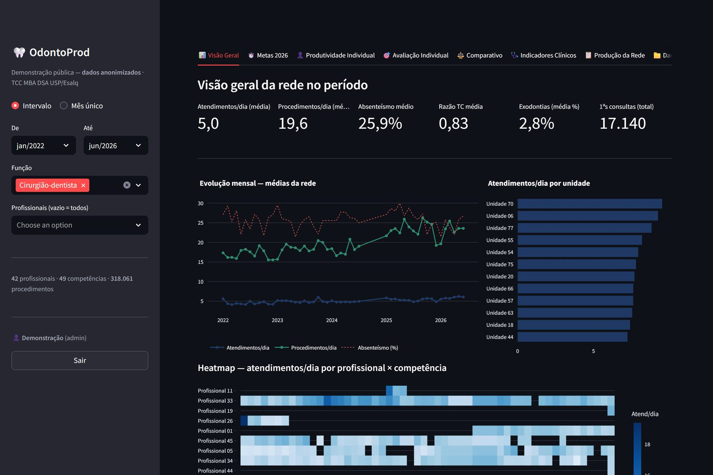
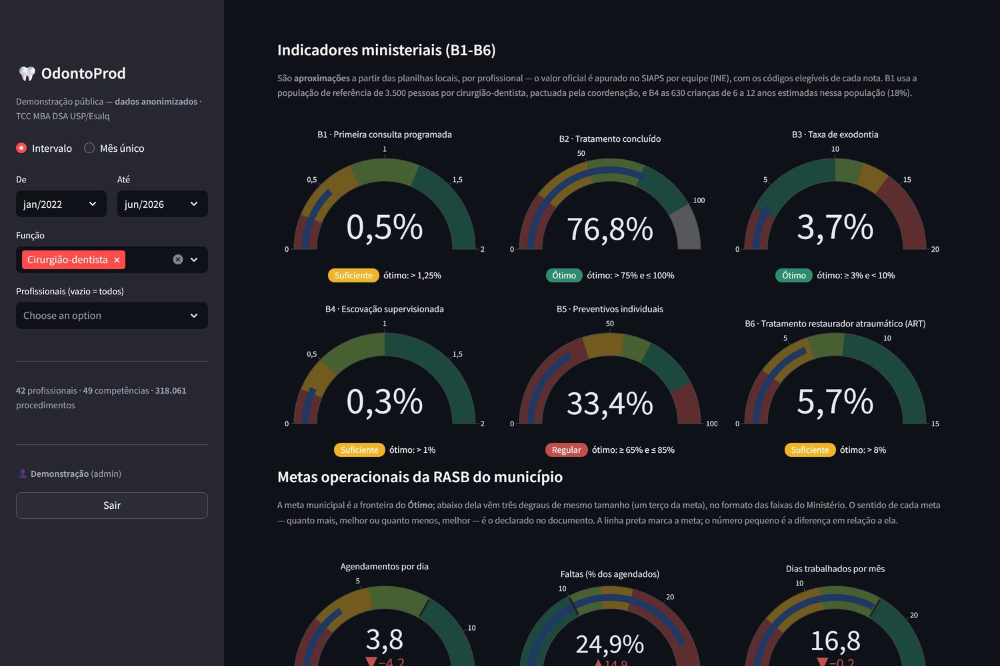
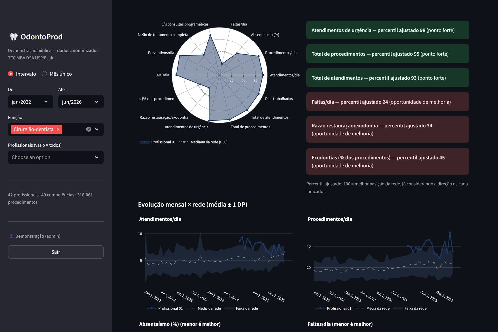

# OdontoProd — Demonstração

Painel de monitoramento da produção em saúde bucal na Atenção Primária à
Saúde (APS), desenvolvido como produto do TCC do MBA em Data Science &
Analytics (USP/Esalq).

**App no ar:** https://odontosus-demo.streamlit.app (acesso com usuário e
senha de demonstração)

> **Todos os dados desta demonstração são anonimizados**: profissionais e
> unidades aparecem como "Profissional NN" e "Unidade NN". A versão
> operacional, com nomes reais, roda apenas em ambiente local do município,
> em conformidade com a LGPD.



## O problema

Na saúde bucal municipal, a produção é registrada em planilhas mensais
preenchidas por cada cirurgião-dentista e técnico em saúde bucal — com
linhas removidas, cabeçalhos digitados com erro, fórmulas de total
quebradas, cópias duplicadas e duas gerações de modelo no mesmo acervo.
O OdontoProd transforma esse acervo em base analítica auditável e em
monitoramento contínuo por profissional e competência.

## A base desta demonstração

| | |
|---|---|
| Período | janeiro/2022 a junho/2026 (49 competências) |
| Lançamentos diários | 190.447 |
| Procedimentos | 528.409 |
| Profissionais / unidades | 47 / 88 |
| Observações profissional × mês | 1.089, com 21 indicadores cada |

## Como funciona

```
planilhas mensais (.ods / .xlsx)
   │  src/ingestao/   leitura tolerante: acha procedimentos pelo código
   │                  SIGTAP, repara cabeçalho de dias, recalcula totais
   │                  e registra em aviso TODA decisão automática
   ▼
base canônica (Parquet)
   │  src/indicadores/motor.py   21 indicadores por profissional × mês
   │  src/indicadores/metas.py   faixas das metas de 2026
   ▼
painel web (app.py, Streamlit + Plotly) e relatórios em PDF
```

Princípio central: **nenhuma decisão automática é silenciosa**. Correções,
descartes e inferências viram aviso no relatório de qualidade, e os totais
são sempre recalculados dos lançamentos diários — nunca copiados da coluna
de total da planilha.

## Módulos do painel

1. **Visão Geral** — indicadores-síntese, evolução mensal, comparação entre
   unidades e mapa de calor profissional × competência
2. **Metas 2026** — velocímetros dos seis indicadores ministeriais (B1 a B6)
   e das metas operacionais municipais, com faixas Ótimo / Bom / Suficiente /
   Regular; recorte da rede ou de um profissional
3. **Produtividade Individual** — evolução de cada indicador contra a rede
4. **Avaliação Individual** — percentil ajustado à direção de cada indicador,
   radar de posição relativa, destaques automáticos e **relatório de
   devolutiva em PDF**, sempre comparando com pares da mesma função
5. **Comparativo** — rankings, boxplots e matriz indicador × profissional
6. **Indicadores Clínicos** — tratamento completado, restaurações ×
   exodontias × ART
7. **Produção da Rede** — produção por grupo de procedimentos, sem somar
   consultas, preventivos e curativos na mesma contagem
8. **Dados & Exportação** — tabela analítica e download





## Metas de 2026

- **Ministeriais (B1 a B6):** faixas das notas metodológicas do Ministério
  da Saúde (maio/2026). B1 e B4 usam população de referência pactuada
  localmente (3.500 pessoas por cirurgião-dentista; 18% delas com 6 a 12
  anos). São aproximações a partir das planilhas — o valor oficial é
  apurado no SIAPS por equipe.
- **Operacionais:** a meta municipal é a fronteira do Ótimo; abaixo dela,
  três degraus de um terço da meta produzem Bom, Suficiente e Regular.
- Cada indicador aparece só para a função que o realiza: a técnica em
  saúde bucal não é medida em exodontia, restauração ou urgência.

## Stack

Python · Streamlit · Plotly · pandas · Parquet · Matplotlib (relatórios em PDF)

## Executar localmente

```bash
pip install -r requirements.txt
streamlit run app.py
```

Configure as credenciais em `.streamlit/secrets.toml` (ver `src/auth.py`).
As senhas ficam guardadas em PBKDF2-SHA256 com sal por senha.

## Testes

151 testes automatizados cobrem o motor de indicadores, as faixas das metas,
o classificador de grupos de produção, a autenticação, os dois leitores de
planilha (incluindo planilha com defeito proposital: mês divergente, dia fora
de sequência, total que não fecha e linha criada à mão) e a **anonimização
dos dados publicados aqui**.

```bash
pip install -r requirements-dev.txt
python verificar.py          # flake8 + pytest
python -m pytest             # só os testes
```

O teste de anonimização (`tests/test_anonimizacao.py`) falha se algum
identificador real, ou algum arquivo do ambiente local com dado nominal,
chegar a este repositório — é a guarda que mantém a demonstração publicável.

## Estrutura

```
app.py                     painel web
src/auth.py                login e sessão
src/ingestao/              leitores das planilhas (modelo 2022-24 e 2025+)
src/indicadores/           motor de indicadores, grupos e metas
src/relatorios/            relatórios em PDF
dados/                     base anonimizada (Parquet)
tests/                     testes automatizados
```
